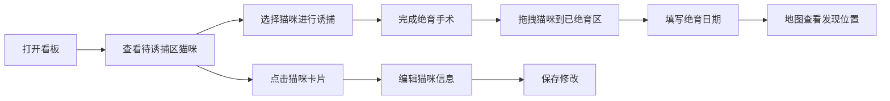

## 1. 产品概述

流浪猫TNR管理看板是一款面向社区志愿者的协作工具，用于跟踪流浪猫的诱捕（Trap）、绝育（Neuter）、放归（Return）全流程状态。通过可视化看板和地图标记，帮助社区高效管理TNR工作。

- 目标用户：社区TNR志愿者、流浪动物救助组织
- 核心价值：可视化跟踪TNR状态、减少重复工作、提升协作效率

## 2. 核心功能

### 2.1 用户角色
无多角色区分，所有用户均为志愿者，拥有完整操作权限。

### 2.2 功能模块
1. **看板主页**：待诱捕区、已绝育区双栏布局，猫咪卡片拖拽流转
2. **猫咪信息卡片**：照片展示、毛色标记、性别标记、绝育日期记录
3. **发现位置地图**：小地图标点显示最近发现流浪猫的位置
4. **猫咪信息编辑**：支持修改猫咪的毛色、性别、绝育日期等信息

### 2.3 页面详情
| 页面名称 | 模块名称 | 功能描述 |
|-----------|-------------|---------------------|
| 看板主页 | 待诱捕区 | 展示待诱捕猫咪卡片列表，支持接收拖拽 |
| 看板主页 | 已绝育区 | 展示已绝育猫咪卡片列表，支持接收拖拽 |
| 看板主页 | 猫咪卡片 | 显示照片、毛色标签、性别标签、绝育日期，支持拖拽和点击编辑 |
| 看板主页 | 位置地图 | 右上角小地图，显示猫咪最近发现位置的标点 |
| 看板主页 | 编辑弹窗 | 点击卡片弹出编辑表单，可修改毛色、性别、绝育日期 |

## 3. 核心流程

### 3.1 主流程
志愿者打开看板 → 查看待诱捕区猫咪列表 → 选中目标猫咪进行诱捕 → 完成绝育后拖拽猫咪到已绝育区 → 记录绝育日期 → 在地图上查看猫咪发现位置

### 3.2 流程图

## 4. 用户界面设计

### 4.1 设计风格
- **主色调**：温暖的橙色系（#F97316）作为主色，搭配米白色背景（#FEF7ED）和深褐色文字（#3F2A1D），呼应流浪猫救助的温暖主题
- **辅助色**：绿色（#22C55E）表示已完成绝育状态，蓝灰色（#64748B）表示待处理状态
- **按钮风格**：圆角胶囊形状，带柔和阴影，hover时有轻微上浮效果
- **字体**：标题使用"Noto Serif SC"衬线体，正文使用"Noto Sans SC"无衬线体
- **布局风格**：卡片式布局，双栏看板，右上角悬浮小地图
- **图标**：使用lucide-react图标库，与猫咪主题相关的图标（Cat, MapPin, Calendar, Scissors等）
- **整体氛围**：温暖、治愈、友好，带有手绘质感的圆角和柔和阴影

### 4.2 页面设计概览
| 页面名称 | 模块名称 | UI元素 |
|-----------|-------------|-------------|
| 看板主页 | 页面头部 | 温暖渐变背景、项目标题"社区TNR管理看板"、猫咪统计数字（待诱捕/已绝育） |
| 看板主页 | 待诱捕区 | 蓝灰色标题栏、卡片网格布局、空状态提示 |
| 看板主页 | 已绝育区 | 绿色标题栏、卡片网格布局、空状态提示 |
| 看板主页 | 猫咪卡片 | 圆角照片、毛色标签、性别图标、绝育日期徽章、拖拽手柄样式、hover阴影加深 |
| 看板主页 | 位置地图 | 右上角悬浮、圆角边框、半透明毛玻璃背景、猫爪形状标点 |
| 看板主页 | 编辑弹窗 | 居中模态框、半透明遮罩、表单输入、保存/取消按钮 |

### 4.3 响应式
- 桌面端优先设计（≥1024px）：双栏并排布局，地图悬浮在右上角
- 平板端（768-1023px）：双栏并排，缩小间距，地图嵌入顶部
- 移动端（<768px）：单栏上下堆叠，地图折叠可展开

### 4.4 动画与交互
- 卡片拖拽时：半透明效果跟随鼠标，目标区域高亮
- 卡片放置完成：弹性回弹动画
- 页面加载：卡片依次淡入（staggered animation）
- 地图标点：呼吸动效提示活跃位置
