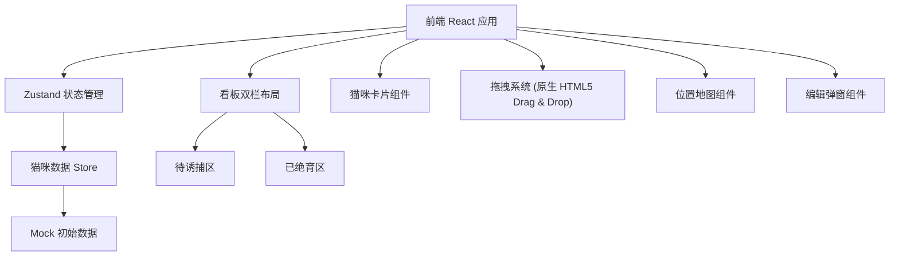
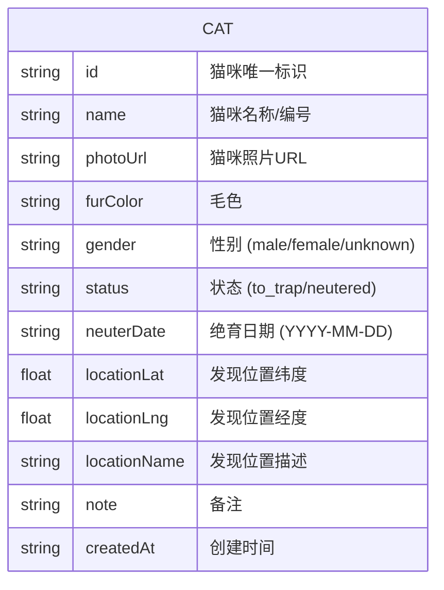

## 1. 架构设计



## 2. 技术说明

- 前端：React@18 + TypeScript + Vite
- 样式：Tailwind CSS 3
- 状态管理：Zustand
- 拖拽：原生 HTML5 Drag & Drop API
- 地图：使用 SVG 绘制简化示意地图，无需外部地图服务
- 图标库：lucide-react
- 后端：无（纯前端应用，数据存储在 localStorage）
- 数据持久化：localStorage

## 3. 路由定义

| 路由 | 用途 |
|-------|---------|
| / | 看板主页（唯一页面） |

## 4. 数据模型

### 4.1 数据模型定义



### 4.2 TypeScript 类型定义

```typescript
type CatGender = 'male' | 'female' | 'unknown';
type CatStatus = 'to_trap' | 'neutered';

interface CatLocation {
  lat: number;
  lng: number;
  name: string;
}

interface Cat {
  id: string;
  name: string;
  photoUrl: string;
  furColor: string;
  gender: CatGender;
  status: CatStatus;
  neuterDate?: string;
  location: CatLocation;
  note?: string;
  createdAt: string;
}
```

### 4.3 初始 Mock 数据

预置 8 只猫咪数据，包含待诱捕和已绝育两种状态，涵盖不同毛色和性别，位置分布在社区不同区域。
